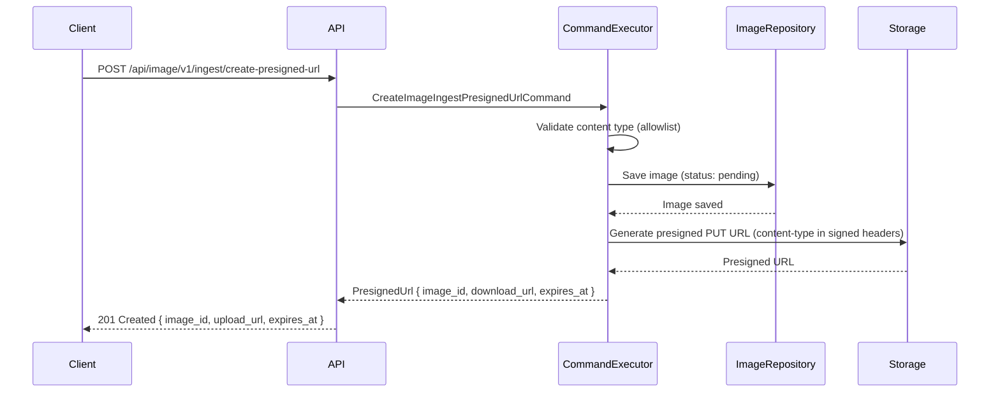
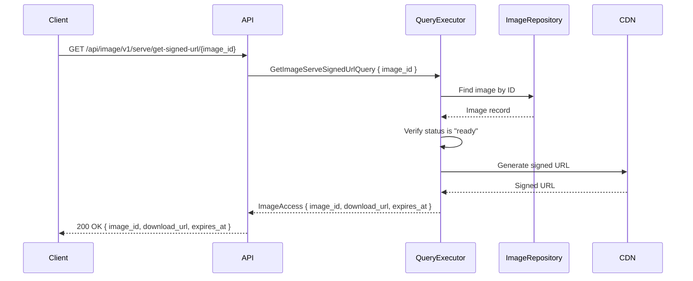
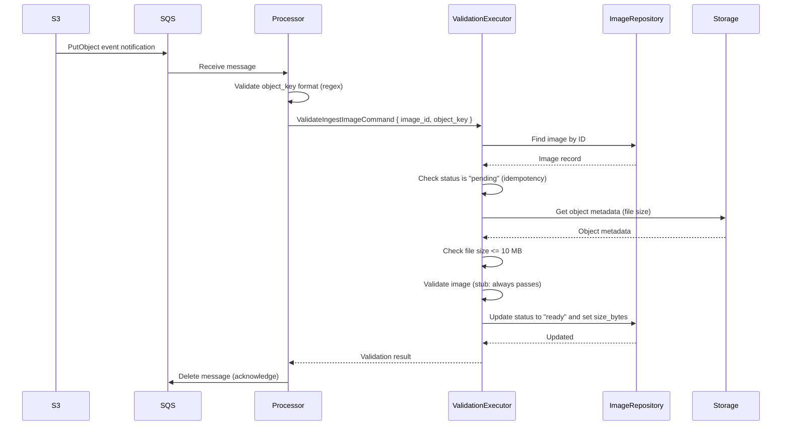

# Image management PRD

## 1. Overview

This document outlines the product requirements for building an image management feature in the media service. The feature enables clients to ingest images into private S3 storage via presigned URLs, store image metadata in PostgreSQL, serve images through CloudFront signed URLs, and validate ingested images asynchronously through an SQS-driven worker.

## 2. Business context

The media service needs a foundational image pipeline that supports secure ingest, storage, and delivery. Images must be stored in private S3 buckets with access exclusively through CloudFront, ensuring bucket names are never exposed to clients. Post-ingest validation ensures only valid images are served.

## 3. Success criteria

The feature is complete when all of the following criteria are met.

- Clients can request a presigned upload URL and upload an image directly to S3.
- Image metadata is persisted in PostgreSQL before the upload URL is returned.
- Ingested images are accessible via CloudFront signed URLs with a 10-minute expiry.
- Both single and batch image retrieval are supported.
- S3 upload events trigger validation through SQS, and image status transitions to "ready" upon success.
- Post-ingest validation enforces the 10 MB file size limit by checking the actual file size in S3.
- S3 bucket names are never exposed in URLs returned to clients.

## 4. User stories

These user stories describe the key interactions from the perspective of API clients and system operators.

- As an API client, I want to request a presigned upload URL so that I can upload an image directly to S3 without routing file bytes through the service.
- As an API client, I want to retrieve a signed URL for a single image by image ID so that I can display it.
- As an API client, I want to retrieve signed URLs for multiple images in a single request so that I can load gallery views efficiently.
- As a system operator, I want ingested images to be validated asynchronously so that only valid images are marked as ready for serving.

## 5. Functional requirements

This section covers the three core capabilities: presigned URL generation, image serving, and post-ingest validation.

### 5.1. Create presigned URL

This section covers presigned URL generation for image ingest, including request validation, database persistence, and S3 URL signing.

#### 5.1.1. Summary

The client requests a presigned URL for uploading an image. The service validates the request, creates an image record in the database with status "pending," generates an S3 presigned PUT URL, and returns both the upload URL and the new image ID. The presigned URL expires in 5 minutes.

The client provides `content_type` and `file_name` in the request body. The service validates the content type against an allowlist before generating the presigned URL. The service signs the content type into the presigned URL; however, enforcement depends on the AWS SDK including `Content-Type` in the signed headers (`X-Amz-SignedHeaders`). This behavior is not guaranteed across all AWS SDK versions (see known issues in Go v2 SDK and similar concerns in the Rust SDK). Post-ingest validation is the authoritative enforcement point for content type correctness.

Note on file size enforcement: S3 presigned PUT URLs cannot enforce `content-length-range` conditions, and the client does not declare a file size at upload time. The only size enforcement happens during post-ingest validation (section 5.3), which checks the actual file size in S3. If the ingested file exceeds 10 MB, validation marks the image as "failed." Note: S3 presigned POST with a policy document would natively support `content-length-range` enforcement, but the Rust AWS SDK (`aws-sdk-s3`) doesn't currently support presigned POST. Revisit this when SDK support becomes available.

Note on S3 presigned URLs exposing bucket names: S3 presigned URLs include the bucket name in the URL hostname (for example, `bucket-name.s3.region.amazonaws.com`). While the bucket itself is private and the presigned URL is time-limited, exposing the bucket name reveals infrastructure details. However, for ingest operations, S3 presigned URLs are the standard and most practical approach. CloudFront signed URLs are designed for read access (GET) and don't natively support PUT operations for uploads. Routing uploads through CloudFront adds complexity (custom domain, OAC configuration for writes, signature compatibility issues) with minimal security benefit since the bucket is private and the presigned URL is short-lived. Decision: Use S3 presigned PUT URLs directly for ingest. For serving (read access), use CloudFront signed URLs which hide the bucket name behind a CDN domain.

Note on object key format: The S3 object key uses only the image ID (`ingest/{image_id}`), not the original filename. The original `file_name` is stored in the database for metadata purposes only. This eliminates path traversal and special character concerns from user-supplied filenames.

#### 5.1.2. Sequence diagram

The following diagram shows the interaction between the client, API, and infrastructure components during presigned URL creation.



#### 5.1.3. API specification

This section defines the request and response format for the presigned URL endpoint.

##### `POST /api/image/v1/ingest/create-presigned-url`

Request body:

```json
{
  "content_type": "image/jpeg",
  "file_name": "photo.jpg"
}
```

The following constraints apply to each field.

- `content_type` (required): Must be an exact match against the allowlist. Supported values: `image/jpeg`, `image/png`, `image/webp`, `image/avif`, `image/gif`. Pattern matching (for example, `image/*`) and parameterized MIME types (for example, `image/jpeg;text/html`) are rejected.
- `file_name` (required): Original file name. Stored in database for metadata only. Not used in the S3 object key. Maximum 255 characters.

Response (201 Created):

```json
{
  "image_id": "01J5A3B7C8D9E0F1G2H3I4J5K6",
  "upload_url": "https://bucket.s3.region.amazonaws.com/...",
  "expires_at": "2026-02-22T10:05:00Z"
}
```

The endpoint returns the following error responses.

- 400 Bad Request: Invalid or unsupported content type, missing required fields, or content type not in the allowlist.
- 500 Internal Server Error: Database or S3 failure.

#### 5.1.4. Database schema

The `image_records` table stores metadata for ingested images. Each media type (image, short-form video, long-form video) has its own table and feature slice. See section 5.4 for the architectural decision on media type separation.

```sql
CREATE TABLE image_records (
    id          TEXT PRIMARY KEY,
    status      TEXT NOT NULL,
    content_type TEXT NOT NULL,
    file_name   TEXT NOT NULL,
    size_bytes  BIGINT,
    object_key  TEXT NOT NULL,
    created_at  TIMESTAMPTZ NOT NULL DEFAULT now(),
    updated_at  TIMESTAMPTZ NOT NULL DEFAULT now()
);
```

The following notes describe each field in the schema.

- `id`: ULID string for sortable, unique identification. Trade-off: TEXT ULID uses approximately 60% more index space than a native UUID column. At the expected scale of this feature, this is acceptable. If storage efficiency becomes a concern, consider migrating to UUID v7 (which preserves time-ordering and uses native 16-byte storage).
- `status`: One of "pending," "ready," "failed." Starts as "pending" at presigned URL creation.
- `size_bytes`: Nullable. Unknown at ingest time because S3 presigned PUT URLs cannot enforce content-length-range and the client does not declare a file size. Populated during post-ingest validation by reading the actual file size from S3.
- `object_key`: The S3 object key where the file is stored. Format: `ingest/{image_id}`.
- `file_name`: Original filename from the client. Stored for metadata only, never used in S3 object paths.
- `updated_at`: Updated when status changes.

### 5.2. Serve image by image ID

This section covers single and batch image retrieval via CloudFront signed URLs.

#### 5.2.1. Summary

The client requests access to an image by image ID. The service looks up the image record, verifies it is in "ready" status, and returns a CloudFront signed URL with a 10-minute expiry. This endpoint supports single image retrieval. A separate batch endpoint handles multiple IDs in one request.

#### 5.2.2. Sequence diagram

The following diagram shows the interaction flow for serving a single image by image ID.



#### 5.2.3. API specification

This section defines the endpoints for retrieving signed URLs for single and batch image access.

##### `GET /api/image/v1/serve/get-signed-url/{image_id}`

Path parameters:

- `image_id` (required): The image ID returned from the presigned URL endpoint.

Response (200 OK):

```json
{
  "image_id": "01J5A3B7C8D9E0F1G2H3I4J5K6",
  "download_url": "https://d111111abcdef8.cloudfront.net/ingest/01J5A3B7C8D9E0F1G2H3I4J5K6?Signature=...",
  "expires_at": "2026-02-22T10:10:00Z"
}
```

The endpoint returns the following error responses.

- 404 Not Found: Image ID doesn't exist or status isn't "ready." If the image exists but is still "pending," return 404 with a response body indicating the image isn't yet available (see section 7, Risk R2).
- 500 Internal Server Error: Database or CDN signing failure.

##### `POST /api/image/v1/serve/get-signed-urls`

This endpoint uses POST for a read operation because the request body contains a list of image IDs that may exceed practical URL length limits for GET requests. This is a deliberate trade-off of REST purity for usability.

Request body:

```json
{
  "image_ids": ["01J5A3B7C8D9E0F1G2H3I4J5K6", "01J5A3B7C8D9E0F1G2H3I4J5K7"]
}
```

The following constraints apply to each field.

- `image_ids` (required): Array of image IDs. Maximum 50 items per request. Duplicate IDs are silently deduplicated — the response `items` array contains at most one entry per unique image ID.

Response (200 OK):

```json
{
  "items": [
    {
      "image_id": "01J5A3B7C8D9E0F1G2H3I4J5K6",
      "download_url": "https://d111111abcdef8.cloudfront.net/...",
      "expires_at": "2026-02-22T10:10:00Z"
    },
    {
      "image_id": "01J5A3B7C8D9E0F1G2H3I4J5K7",
      "download_url": "https://d111111abcdef8.cloudfront.net/...",
      "expires_at": "2026-02-22T10:10:00Z"
    }
  ],
  "not_found": []
}
```

The `not_found` array contains image IDs that either don't exist or aren't in "ready" status. This lets the client handle partial results gracefully without the entire request failing. Note: The endpoint returns 200 OK even when all requested IDs are in the `not_found` array (that is, `items` is empty). This is intentional for consistent partial-result handling — clients don't need to distinguish between "some found" and "none found" at the HTTP status level.

The endpoint returns the following error responses.

- 400 Bad Request: Empty array or exceeds 50-item limit.
- 500 Internal Server Error: Database or CDN signing failure.

### 5.3. Post-ingest validation via SQS

This section covers the asynchronous validation pipeline that processes S3 events through SQS and transitions image records from "pending" to "ready" or "failed."

#### 5.3.1. Summary

After a client uploads an image to S3 using the presigned URL, S3 sends an event notification to an SQS queue. The processor worker consumes messages from this queue, validates the ingested image (stub implementation for now), and updates the image status in the database to "ready" on success or "failed" on failure.

The validation also checks the actual file size in S3. If the ingested file exceeds 10 MB, validation marks the image as "failed." This is the only enforcement point for file size because S3 presigned PUT URLs cannot enforce `content-length-range` and the client does not declare a file size at ingest time.

During successful validation, the processor writes the actual file size (read from S3 object metadata) into the `size_bytes` column, which is null at ingest time.

The validation command lives in the image ingest feature slice because validation is part of the ingest lifecycle: it completes the ingest-to-ready transition. Creating a separate feature slice for a single command would be premature at this stage. If validation grows in complexity (for example, virus scanning, thumbnail generation), it can be extracted into its own feature slice.

#### 5.3.2. Sequence diagram

The following diagram shows the validation flow from S3 event notification through SQS to the processor worker.



#### 5.3.3. Event specification

This section describes the S3 event publishing configuration and the SQS consumer behavior.

##### S3 event publisher

The S3 bucket is configured to send `s3:ObjectCreated:Put` events to an SQS queue. The event payload follows the standard S3 event notification format.

The processor extracts the following fields from each event record.

- `s3.bucket.name`: Bucket name (used for verification).
- `s3.object.key`: Object key in the format `ingest/{image_id}`.

##### SQS event consumer

The processor polls the SQS queue using long polling. Each message contains one or more S3 event records. The processor validates the object key format using a regex pattern (for example, `^ingest/[0-7][0-9A-HJKMNP-TV-Z]{25}$` for ULID Crockford Base32) before extracting the image ID. Messages with object keys that don't match the expected format are logged and deleted without processing.

For valid messages, the processor extracts the image ID, runs validation, updates the database, and deletes the message from the queue on success.

On validation failure, the processor updates the image status to "failed," deletes the S3 object to prevent storage accumulation, and deletes the message (no retry for validation failures). On infrastructure failures (database unavailable, transient errors), the message is left in the queue for automatic retry via SQS visibility timeout.

Idempotency: The processor only processes image records with status "pending." If a message is received for an image already in "ready" or "failed" status (due to SQS at-least-once delivery), the processor skips processing and deletes the message. This prevents re-processing of already-validated images.

The SQS queue must be configured with a dead-letter queue (DLQ). Messages that fail processing after the max receive count (recommended: 3) are moved to the DLQ for manual inspection rather than cycling indefinitely.

### 5.4. Architectural decision: separate aggregates per media type

The service handles three media types: images, short-form video, and long-form video. Each media type is modeled as a separate aggregate with its own table, ID type, repository, and feature slice. This section documents the reasoning behind this decision.

#### Rationale

Each media type has fundamentally different characteristics that make a shared model impractical:

- No shared invariants: Images, short-form video, and long-form video have different ingest constraints, size limits, and supported content types. There are no business rules that span across types.
- Different lifecycles: Images require no transcoding, short-form video uses progressive MP4, and long-form video uses CMAF/HLS with an ABR ladder. Each type moves through distinct processing stages.
- Different serving mechanisms: Images and short-form video use signed URLs. Long-form video uses signed cookies with HLS manifests. A shared endpoint would require discriminated unions or conditional response shapes.
- Clean schemas: Each table contains only the columns relevant to that type, with no nullable columns for type-specific fields.
- Type-safe IDs: `ImageId`, `ShortVideoId`, and `LongVideoId` are distinct newtypes. The compiler prevents accidentally passing an image ID where a video ID is expected.
- Vertical slice alignment: Each media type maps to its own feature slice, consistent with the project's architecture principle that features don't directly reference other features.

#### Implementation

The `image_records` table defined in this PRD stores only image records. When video support is added, short-form and long-form video will each get their own tables (`short_videos`, `long_videos`) and feature slices with their own domain types, commands, queries, and repositories.

Shared infrastructure (S3 client, CloudFront signer, SQS consumer, database pool) remains in `shared/` and is reused across feature slices. Only the domain models, commands, queries, and repositories are type-specific.

API paths follow the same separation: `/api/image/v1/...` for images, `/api/short-video/v1/...` for short-form video, and `/api/long-video/v1/...` for long-form video.

#### Trade-offs

- More tables and feature slices to create per media type.
- No single ID space across all media types. If a cross-type lookup is needed in the future, it requires querying multiple tables.

## 6. Non-functional requirements

These requirements define the performance, security, reliability, and observability expectations for the image management feature.

**Performance:**

- Presigned URL generation must respond within 200ms (P95).
- Single image signed URL generation must respond within 100ms (P95).
- Batch image endpoint must respond within 500ms for 50 items (P95).
- SQS message processing latency must be under 5 seconds from event delivery.

**Security:**

- S3 bucket must remain private with no public access.
- Presigned ingest URLs expire in 5 minutes.
- The service signs the content type into the presigned URL. Enforcement depends on the SDK including `Content-Type` in signed headers — this must be verified during implementation. Post-ingest validation is the authoritative enforcement point.
- Content type validation uses exact match against an allowlist (not prefix or pattern matching) to prevent MIME smuggling (for example, `image/jpeg;text/html`).
- CloudFront signed URLs expire in 10 minutes.
- CloudFront responses must include `X-Content-Type-Options: nosniff` to prevent MIME-type sniffing attacks. This is configured as a CloudFront response header policy.
- File size is enforced exclusively during post-ingest validation by checking the actual file size in S3. S3 presigned PUT URLs cannot enforce `content-length-range`.
- The SQS consumer validates the object key format with a regex before extracting the image ID to prevent injection via crafted S3 events.
- S3 object keys use only the image ID (`ingest/{image_id}`), not user-supplied filenames, eliminating path traversal risks.

**Reliability:**

- SQS messages that fail due to transient errors are retried automatically via visibility timeout.
- A dead-letter queue captures messages that exceed the max receive count (3 attempts).
- Validation failures result in "failed" status, not retries.
- SQS at-least-once delivery is handled via idempotency guards (only process "pending" records).
- Database operations use connection pooling to handle concurrent requests.

**Observability:**

- All operations are traced using the `tracing` crate.
- Key events to log: presigned URL created, image status transitions, validation results, SQS message processing, and DLQ routing.

## 7. Risks and mitigations

This section identifies known risks and their mitigations.

### R1: S3 event at-least-once delivery

SQS delivers S3 event notifications at least once, which means duplicate events can trigger re-processing of already-validated images. Mitigation: The validation executor checks that image status is "pending" before processing. Records already in "ready" or "failed" status are skipped.

### R2: Race condition — serve before validation completes

A client may upload a file and immediately request the serve endpoint, receiving a 404 because validation hasn't yet completed and the status is still "pending." Mitigation: The 404 response for existing-but-pending images must include a distinct message (for example, `"message": "image is not yet available"`) so clients can distinguish "not found" from "still processing" and implement retry logic.

### R3: No cleanup for orphaned pending records

Clients may request a presigned upload URL but never complete the upload, leaving image records stuck in "pending" status indefinitely. Mitigation: This is deferred to a future task. Options include S3 lifecycle rules to expire incomplete uploads and a scheduled job to purge stale pending records (for example, older than 24 hours).

### R4: No authentication or rate limiting

This feature doesn't include authentication or rate limiting. The service is assumed to be internal-only, deployed behind an API gateway or load balancer that handles authentication and rate limiting. If the service is exposed publicly in the future, these must be added.

### R5: PEM private key in environment variable

The CloudFront private key PEM is loaded from an environment variable (`CLOUDFRONT_PRIVATE_KEY_PEM`). This is acceptable for local development and initial deployment. For production, store the key in AWS Secrets Manager or SSM Parameter Store and load it at startup.

### R6: Stub validation must be replaced before production

The post-ingest validation in this feature is a stub that always succeeds. Before production use, it must be replaced with real validation that checks actual MIME type via magic bytes detection (not the Content-Type header, which is client-declared and untrusted). This is explicitly marked in the task breakdown.

### R7: No pre-ingest size enforcement

Because S3 presigned PUT URLs cannot enforce `content-length-range` and the client does not declare a file size, there is no pre-ingest size enforcement. A malicious or misconfigured client can upload arbitrarily large files before validation rejects them. Mitigation: Post-ingest validation checks the actual file size and marks oversized ingests as "failed." For additional protection, consider configuring an S3 bucket lifecycle rule to automatically delete objects larger than a threshold, or use an S3 Object Lambda to reject oversized objects at write time.

## 8. Appendix

This section covers configuration, dependencies, and infrastructure decisions.

### 8.1. Configuration

The service reads the following configuration values from environment variables.

- `DATABASE_URL`: PostgreSQL connection string.
- `AWS_REGION`: AWS region for S3 and SQS.
- `S3_INPUT_BUCKET`: Name of the private S3 bucket for ingest.
- `S3_INGEST_URL_EXPIRY_SECS`: Presigned URL expiry duration (default: 300).
- `S3_MAX_INGEST_SIZE_BYTES`: Maximum ingest file size for post-ingest validation (default: 10485760).
- `SQS_MEDIA_QUEUE_URL`: URL of the SQS queue for S3 event notifications.
- `SQS_MEDIA_DLQ_URL`: URL of the dead-letter queue for failed messages.
- `CLOUDFRONT_DOMAIN`: CloudFront distribution domain name.
- `CLOUDFRONT_KEY_PAIR_ID`: CloudFront key pair ID for signing.
- `CLOUDFRONT_PRIVATE_KEY_PEM`: CloudFront private key in PEM format for signing URLs.
- `CLOUDFRONT_SIGNED_URL_EXPIRY_SECS`: Signed URL expiry duration (default: 600).

### 8.2. Dependencies

The following crates are required and must be added to the workspace and package `Cargo.toml` files.

| Crate                                        | Purpose                                                        | Package                    |
| -------------------------------------------- | -------------------------------------------------------------- | -------------------------- |
| `tokio`                                      | Async runtime                                                  | api, processor             |
| `axum`                                       | HTTP framework                                                 | api                        |
| `serde`, `serde_json`                        | Serialization                                                  | foundation, api            |
| `sqlx` (with postgres, runtime-tokio-rustls) | Database access                                                | foundation                 |
| `aws-sdk-s3`                                 | S3 presigned URL generation                                    | foundation                 |
| `aws-sdk-sqs`                                | SQS message consumption                                        | foundation                 |
| `aws-config`                                 | AWS SDK configuration                                          | foundation                 |
| `cloudfront_sign`                            | CloudFront signed URL and cookie generation (wraps rsa + sha1) | foundation                 |
| `async-trait`                                | Async methods in trait objects (`Arc<dyn Trait>`)              | foundation                 |
| `thiserror`                                  | Error types                                                    | foundation                 |
| `tracing`, `tracing-subscriber`              | Observability                                                  | foundation, api, processor |
| `chrono`                                     | Date/time handling                                             | foundation                 |
| `ulid`                                       | ULID generation for image IDs                                  | foundation                 |
| `tower-http`                                 | HTTP middleware (CORS, tracing)                                | api                        |
| `regex`                                      | Object key pattern validation                                  | foundation                 |
| `rstest`                                     | Parameterized testing                                          | foundation (dev)           |

Note: The `aws-sdk-cloudfront` crate is a CloudFront management API client and doesn't provide URL signing functionality. The `cloudfront_sign` crate is used instead, which provides `get_signed_url` and `get_signed_cookie` functions using RSA-SHA1 signing.

### 8.3. S3 bucket name exposure analysis

S3 presigned URLs contain the bucket name in the hostname (for example, `my-bucket.s3.us-east-1.amazonaws.com`). The concern is that this reveals infrastructure details to clients.

The analysis produced the following findings:

1. The bucket is private. Knowing the bucket name alone doesn't grant access.
2. Presigned URLs are time-limited (5 minutes) and scoped to a specific operation (PUT) and object key.
3. CloudFront doesn't natively support PUT operations for uploads. Routing uploads through CloudFront requires additional complexity (custom domain configuration, OAC for writes, signature compatibility adjustments) with no meaningful security benefit.
4. For serving (GET), CloudFront signed URLs are already used, which hide the bucket name behind the CDN domain.
5. If bucket name obfuscation is strictly required in the future, a reverse proxy or API gateway can be placed in front of S3 for uploads, but this adds latency and cost for minimal benefit.

Decision: Accept bucket name exposure for ingest URLs. Use CloudFront signed URLs for serving to hide infrastructure details on the read path.

### 8.4. CloudFront response headers

The CloudFront distribution must be configured with a response headers policy that includes:

- `X-Content-Type-Options: nosniff` — Prevents browsers from MIME-type sniffing, which could lead to content being interpreted as a different type than declared.

This is an infrastructure configuration task, not an application code change. It must be applied to the CloudFront distribution before production use.
